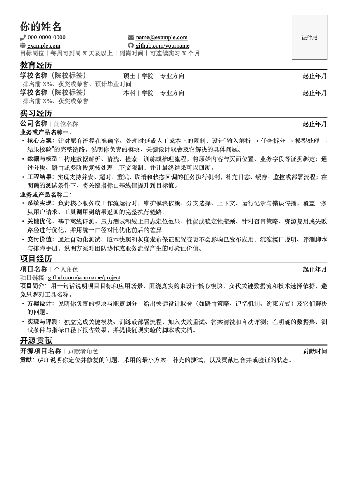

# 中文 LaTeX 简历模板

这是一个可直接编译的中文单页简历模板，适合作为个人简历、项目经历整理或求职材料的起点。仓库内只包含占位内容，不包含任何真实个人信息或真实项目经历。

## 预览
[点击查看 PDF 版本](main.pdf)



## 快速开始

本模板需要使用 XeLaTeX 编译。

```bash
make build
```

编译完成后会生成 `main.pdf`。

如果没有安装 `latexmk`，也可以直接运行：

```bash
xelatex main.tex
```

## 项目结构

```text
.
├── .github/workflows/build.yml  # GitHub Actions 自动编译配置
├── assets/                      # 预览图与可选图片目录
├── main.pdf                     # 可直接查看的模板 PDF
├── main.tex                     # 简历模板源码
├── Makefile                     # 本地构建与清理命令
├── README.md                    # 使用说明
└── LICENSE                      # 开源许可证
```

## 自定义方式

- 修改 `main.tex` 顶部的颜色变量（正文、次要信息、页眉图标、分隔线、占位框底色），可以整体调整配色风格。
- 替换姓名、联系方式、求职意向、教育经历、技能、实习经历、项目经历和开源贡献中的占位文本。
- 联系方式使用 FontAwesome 5 图标（`\resumeContactIcon{\faPhone}` 等），可参考 [FontAwesome 5 图标列表](https://fontawesome.com/v5/icons) 换成其他图标。
- 如需使用证件照，将图片保存为 `assets/photo.png`；若该文件不存在，模板会自动在页面右上角显示占位框。
- `\projectTitle` 的项目链接可以留空；留空时整行链接会自动隐藏。
- 开源条目可追加仓库 star 数，例如 `\projectTitle{项目名\hspace{0.3em}\projectStars{100+ stars}}{...}`。
- 经历要点建议采用“问题/职责 → 技术方案 → 可验证结果”的结构，优先保留与目标岗位直接相关的内容。

## 编译环境

推荐环境：

- TeX Live 2024 或更新版本
- XeLaTeX
- `latexmk`

模板优先使用 `TeX Gyre Termes`、`Noto Serif CJK SC`、`Noto Sans CJK SC` 等跨平台字体；缺少这些字体时，会回退到 macOS 常见中文字体或 TeX Live 自带的 Fandol 字体。联系方式的图标依赖 `fontawesome5` 宏包（TeX Live 完整版自带）。

## 清理构建文件

```bash
make clean
```
